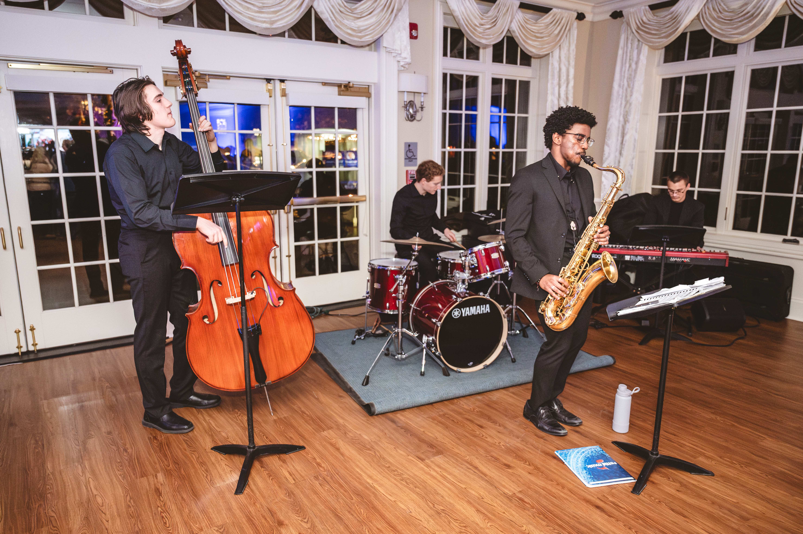
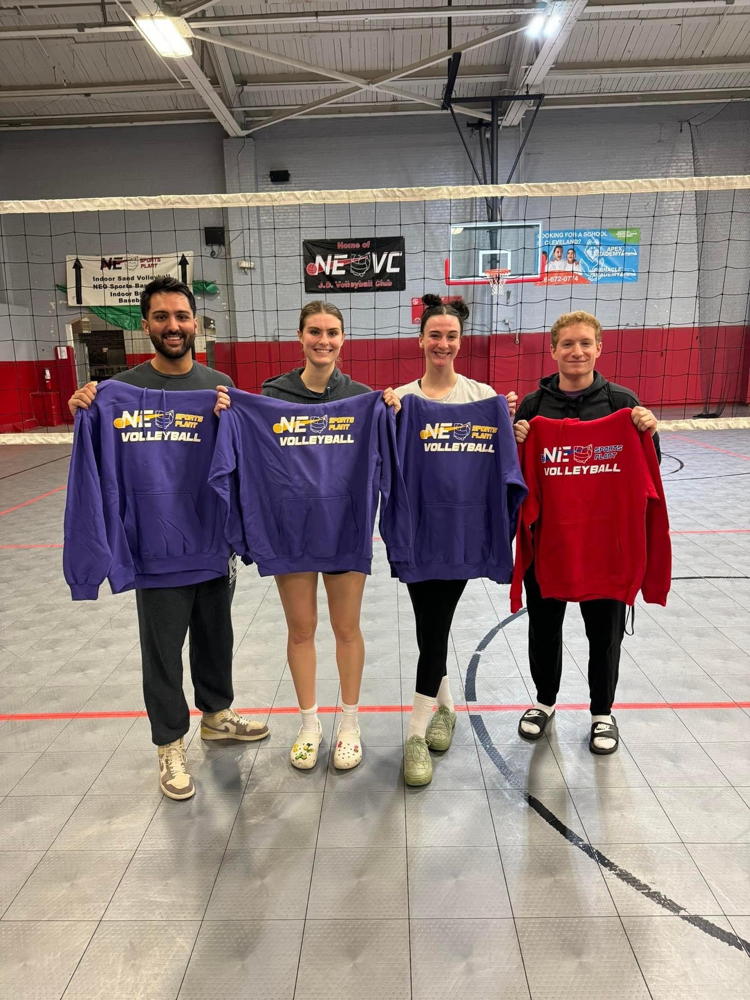

# Drumming

I've been an avid drummer for over 15 years now! I began taking jazz drum lessons in late middle school. Although now I mainly play in jazz ensembles and combos (see below!), I love playing all sorts of genres, including rock, funk, fusion, and more. 

# Volleyball

Volleyball has been my favorite sport since I was young. In my undergraduate years, I was the president of [CWRU Club Volleyball](https://community.case.edu/volleyball/home/), leading the team as the setter to a [national championship](https://thedaily.case.edu/cwru-club-volleyball-mens-team-wins-at-the-national-championship/). Now, I play in leagues and tournaments in the Cleveland area!

