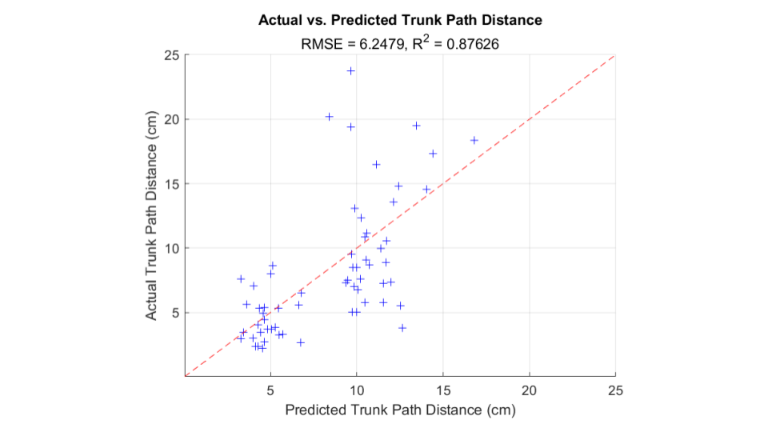

## Wearables + ML for Stroke Rehabilitation

Stroke is a leading cause of death and disability around the world. Of the nearly 800,000 individuals who suffer from stroke per year in the United States, close to 80% of survivors experience full or partial impairment of contralesional limbs. In an attempt to restore function to these weakened parts of the body, patients will undergo intense physical and occupational therapy for several months.  In the first six months immediately following the stroke, the survivor experiences a period of increased neuroplasticity, where the nervous system has the ability to reorganize its connections. Therefore it is crucial to maximize the effectiveness of rehabilitation during this time, so that intact redundant connectivity of the central nervous system can be strengthened, and the formation of new neural circuits is encouraged.

Inertial measurement units (IMUs) have begun gaining traction as a way to monitor the movement of stroke patients as they undergo rehabilitation. However, most of these efforts have been put toward measuring quantity of movement, for example, the ratio of total movements between the affected and unaffected limb. I am attempting to use machine learning techniques to assess the *quality* of movement as well, with hopes to inform the rehailbitation process and improve patient outcomes. 

----

